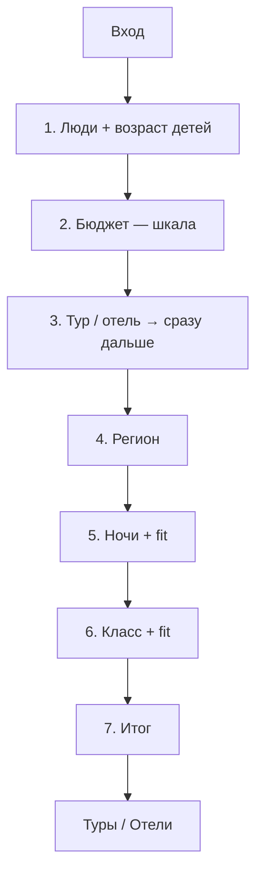

# Лендинг-визард подбора туров/отелей

Человек отвечает на вопросы → кнопка открывает готовую подборку на `online.mosgortur.ru`. Цель бизнеса: выше средний чек (больше ночей / выше класс), не «уложиться в сертификат».

**Статус:** логика согласована. Прод: [`public/podbor.html`](../public/podbor.html) → `https://motrip.ru/podbor`.  
**Прототип:** [`public/podbor-prototype.html`](../public/podbor-prototype.html).

---

## 1. Цель

| Делаем | Не делаем |
|--------|-----------|
| Помочь выбрать: кто едет, бюджет, тур/отель, регион, ночи, класс | Резать выдачу «только до 40 000 ₽» |
| Перейти сразу в нужную подборку | Свой каталог вместо Туры/Отели |
| Сертификат — коротко в футере | Писать про сертификат на шаге бюджета |

---

## 2. Размещение

| Элемент | Решение |
|---------|---------|
| Код | **motrip.ru** — `public/podbor.html` |
| URL | `https://motrip.ru/podbor` |
| МОСГОРТУР | iframe-обёртка + вход с главной |
| Навбар | Не ломаем |

---

## 3. Структура визарда

### Шаг 1 — Кто едет

Как на russia.mosgortur (Level.Travel): взрослые 1–6, дети 0–4, возраст каждого ребёнка (до 1 года … 17 лет).

### Шаг 2 — Бюджет

Шкала 40–360 тыс. шагом 40 тыс., точки-снапы, поле «Своя сумма». Подпись: только «Примерно X ₽ на человека». Без сертификата. Дефолт 80 000 ₽.

### Шаг 3 — Формат

Тур / отель. **Клик сразу открывает шаг 4.**

### Шаг 4 — Регион

Подмосковье / у моря / другой / пока не знаю.

### Шаг 5–6 — Ночи и класс

Все варианты видны. Пометки: обычно в бюджете / может понадобиться доплата / скорее выше бюджета. Дефолт — самый сильный, ещё в бюджете.

Fit v1: клиентская формула-ориентир. Позже — коридоры из поиска.

### Шаг 7 — Итог → handoff

CTA «Показать туры» / «Показать отели». Из iframe — переход в `window.top`.

---

## 4. Handoff

| Формат | Регион | URL |
|--------|--------|-----|
| Тур | море | `/tours/#module6?…` moduleId `68ea30c6-…`, beachLines, ticketsIncluded |
| любой | Подмосковье | `/hotels#module6?…` moduleId `18ff2377-…`, resorts=3799 |
| Отель | иначе | `/new/russia-hotels` |
| Тур | иначе | `/tours` |

Прокидываем: adults, kids/kidsAges, min/max nights, maxPrice=бюджет, minHotelRating (0/3/4), dateFrom/dateTo (+14 дней), utm_source=podbor_wizard.

**Caveat:** `/hotels` → meta-refresh на `/new/russia-hotels` может съесть hash.

---

## 5. Сертификат

Номинал 40 000 ₽/человек. Навигатор: https://online.mosgortur.ru/for-tourists/how-get-certificate/  
На шаге бюджета не упоминаем. В футере входа/итога — коротко.

---

## 6. Метрики

Goals: `podbor_start`, `podbor_step_*`, `podbor_handoff` + средний чек / апгрейд.
