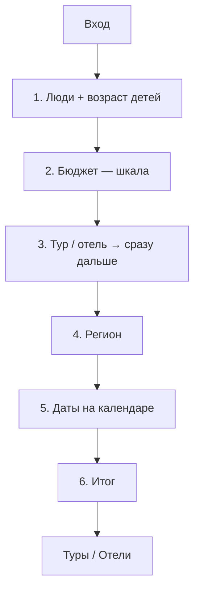

# Лендинг-визард подбора туров/отелей

Человек отвечает на вопросы → кнопка открывает готовую подборку на `online.mosgortur.ru` / `russia.mosgortur.ru`. Цель бизнеса: выше средний чек (больше ночей), не «уложиться в сертификат».

**Статус:** логика согласована. Прод: [`public/podbor.html`](../public/podbor.html) → `https://motrip.ru/podbor`.  
**Прототип:** [`public/podbor-prototype.html`](../public/podbor-prototype.html).

---

## 1. Цель

| Делаем | Не делаем |
|--------|-----------|
| Помочь выбрать: кто едет, бюджет, тур/отель, регион, даты | Резать выдачу «только до 40 000 ₽» |
| Перейти сразу в нужную подборку | Свой каталог вместо Туры/Отели |
| Сертификат — коротко в футере | Писать про сертификат на шаге бюджета |

---

## 2. Размещение

| Элемент | Решение |
|---------|---------|
| Код | **motrip.ru** — `public/podbor.html` |
| URL | `https://motrip.ru/podbor` |
| МОСГОРТУР | iframe-обёртка + вход с главной |
| Навбар | Не ломаем |

---

## 3. Структура визарда

### Шаг 1 — Кто едет

Как на russia.mosgortur (Level.Travel): взрослые 1–6, дети 0–4, возраст каждого ребёнка (до 1 года … 17 лет).

### Шаг 2 — Бюджет

Шкала 40–360 тыс. шагом 40 тыс., точки-снапы, поле «Своя сумма». Подпись: «Примерно X ₽ на человека» = бюджет ÷ (взрослые + дети), без весов и без сертификата. Дефолт 80 000 ₽.

### Шаг 3 — Формат

Тур / отель. **Клик сразу открывает шаг 4.**

### Шаг 4 — Регион

Зависит от формата:

| Формат | Направления |
|--------|-------------|
| Отель | У моря, Подмосковье + СПб, Калининград, Казань, другой, «не знаю» |
| Тур | всё то же **без Подмосковья** (туры в МО не предлагаем) |

Одинаковые карточки с фото: У моря, Подмосковье (только отель), СПб, Калининград, Казань, Другой регион. «Пока не знаю» — ссылка внизу. У моря без Крыма; отели у моря → Сочи.

### Шаг 5 — Даты

Календарь: заезд + выезд. Ночи считаются сами. Дефолт: заезд сегодня+14, выезд +6 ночей.

Fit: ориентир по **средней цене чел./ночь** из оплаченных семейных туров РФ 2026:

| Корзина | ₽/чел./ночь |
|---------|-------------|
| У моря | ~5 020 |
| Подмосковье | ~7 880 |
| СПб | ~6 710 |
| Калининград | ~6 950 |
| Казань | ~6 840 |
| Другой / не знаю | ~5 620 (среднее по РФ) |

Оценка = цена × ночи × люди × 0.88 для отеля. Пороги: ≤105% бюджета — ок, ≤135% — доплата, выше — скорее не влезает.

### Шаг 6 — Итог → handoff

CTA «Показать туры» / «Показать отели». Из iframe — переход в `window.top`.

---

## 4. Handoff

После итога — **сразу выдача**, не пустая форма поиска.  
Ветка только по **формату**: тур → `/tours`, отель → `russia.mosgortur.ru/search`.

### Матрица

| Формат | Регион | Куда | Выдача |
|--------|--------|------|--------|
| Тур | любой (кроме МО) | `online.mosgortur.ru/tours/#module6?action=search&moduleId=68ea30c6-…` | Sletat module6 с параметрами |
| Тур | у моря | + `beachLines=1,2,3&ticketsIncluded=true` | Туры у моря |
| Отель | любой | `russia.mosgortur.ru/search/Any-RU-to-{City}-RU-…` | Список отелей |
| Отель | море / другой / не знаю | city=`Sochi` | Отели Сочи (не Крым) |
| Отель | Подмосковье | city=`Moscow` | Отели МО |
| Отель | СПб / Калининград / Казань | city=`Saint_Petersburg` / `Kaliningrad` / `Kazan` | Отели города |

**Не используем:** голый `/tours`, `/new/russia-hotels`, `/hotels#module6`, увод тура на russia по региону.

### Параметры

**Туры** (`buildTourSearchUrl`) — hash Sletat:

- `adults`, `kids` = возрасты через запятую (`7,10`), не количество
- `dateFrom` = `dateTo` = заезд (`DD/MM/YYYY`); `minNights` = `maxNights` = число ночей
- `minPrice=0`, `maxPrice` = бюджет визарда (сумма на поездку)
- `country=150`, `city=832` (вылет из Москвы), `minHotelRating=0`
- UTM: `utm_source=podbor_wizard`

**Отели** (`buildHotelSearchUrl`):

- Path: `Any-RU-to-{City}-RU-departure-{dd.mm.yyyy}-for-{n}-nights-{adults}-adults-{kidsSeg}-1..5-stars-hotel-type`
- Дата = заезд, `n` = ночи из календаря, stars всегда `1..5`
- Дети в path (формат Level.Travel): без детей — `0-kids`; с детьми — `1(7)-kids`, `2(5,8)-kids` (число + возрасты в скобках через запятую). Варианты вроде `1-kids-7y` дают 302 на главную.
- Бюджет в query (SEO-path цены не принимает): `filter_price_min=0`, `filter_price_max` = бюджет визарда (сумма на поездку). Level.Travel читает эти параметры в фильтр цен.

### Проверено

1. Тур + море → `/tours/#module6?action=search&…&beachLines=1,2,3` + kids ages  
2. Тур + другой → тот же модуль с датами/людьми  
3. Отель + море / МО / СПб → `russia.mosgortur.ru/search/…` с датой и ночами  

---

## 5. Сертификат

Номинал 40 000 ₽/человек. Навигатор: https://online.mosgortur.ru/for-tourists/how-get-certificate/  
На шаге бюджета не упоминаем. В футере входа/итога — коротко.

---

## 6. Метрики

Goals: `podbor_start`, `podbor_step_*`, `podbor_handoff` + средний чек / апгрейд.
