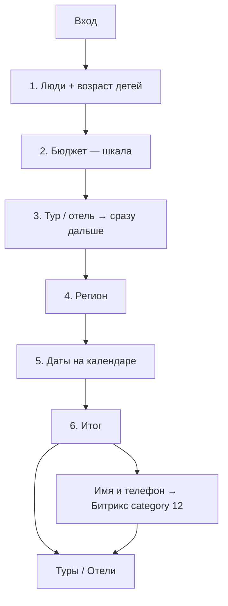

# Лендинг-визард подбора туров/отелей

Человек отвечает на вопросы → кнопка открывает готовую подборку на `online.mosgortur.ru` / `russia.mosgortur.ru`. Цель бизнеса: выше средний чек (больше ночей), не «уложиться в сертификат».

**Статус:** логика согласована. Прод: [`public/podbor.html`](../public/podbor.html) → `https://motrip.ru/podbor`.  
**Прототип:** [`public/podbor-prototype.html`](../public/podbor-prototype.html).

---

## 1. Цель

| Делаем | Не делаем |
|--------|-----------|
| Помочь выбрать: кто едет, бюджет, тур/отель, регион, даты | Резать выдачу «только до 40 000 ₽» |
| Перейти сразу в нужную подборку | Свой каталог вместо Туры/Отели |
| Сертификат — коротко в футере | Писать про сертификат на шаге бюджета |

---

## 2. Размещение

| Элемент | Решение |
|---------|---------|
| Код | **motrip.ru** — `public/podbor.html` |
| URL | `https://motrip.ru/podbor` |
| МОСГОРТУР | iframe-обёртка + вход с главной |
| Навбар | Не ломаем |

---

## 3. Структура визарда



### Шаг 1 — Кто едет

Как на russia.mosgortur (Level.Travel): взрослые 1–6, дети 0–4, возраст каждого ребёнка (до 1 года … 17 лет).

### Шаг 2 — Бюджет

Шкала 40–360 тыс. шагом 40 тыс., точки-снапы, поле «Своя сумма». Подпись: «Примерно X ₽ на человека» = бюджет ÷ (взрослые + дети), без весов и без сертификата. Дефолт 80 000 ₽.

### Шаг 3 — Формат

Тур / отель. **Клик сразу открывает шаг 4.**

### Шаг 4 — Регион

Зависит от формата:

| Формат | Направления |
|--------|-------------|
| Отель | У моря, Подмосковье + СПб, Калининград, Казань, другой, «не знаю» |
| Тур | всё то же **без Подмосковья** (туры в МО не предлагаем) |

Одинаковые карточки с фото. Порядок и состав (кроме моря) — по **выручке** оплаченных семейных туров РФ 2026:

| # | Карточка | Правило |
|---|----------|---------|
| 1 | У моря | Фиксировано: Краснодарский край, Кавказ (без Крыма в UI) |
| 2 | Подмосковье | МО + Москва + Тверь («близко»), только отель |
| 3 | Санкт-Петербург | топ не-море по выручке |
| 4 | Калининград | следующий |
| 5 | Казань | следующий |
| 6 | Другой регион | хвост (Карелия, Калуга, Алтай…). Для **отелей** после клика — выбор конкретного региона: иначе поиск уходит в Сочи |

«Пока не знаю» — ссылка внизу. Отели у моря → Сочи.

### Шаг 5 — Даты

Календарь: заезд + выезд. Ночи считаются сами. Дефолт: заезд сегодня+14, выезд +6 ночей.

Fit: ориентир по **средней цене чел./ночь** из оплаченных семейных туров РФ 2026:

| Корзина | ₽/чел./ночь |
|---------|-------------|
| У моря | ~5 020 |
| Подмосковье | ~7 880 |
| СПб | ~6 710 |
| Калининград | ~6 950 |
| Казань | ~6 840 |
| Другой / не знаю | ~5 620 (среднее по РФ) |

Оценка = цена × ночи × люди × 0.88 для отеля. Пороги: ≤105% бюджета — ок, ≤135% — доплата, выше — скорее не влезает.

### Шаг 6 — Итог → handoff / контакт

Основной CTA: «Показать туры» / «Показать отели» → `openHandoff`. Из iframe — переход в `window.top`.

Необязательно на том же экране: имя + телефон + согласие на ПДн → `POST /api/podbor-lead` → сделка в Битрикс [category/12](https://crm.mosgortur.ru/crm/deal/category/12/) (`STAGE_ID: C12:NEW`). Handoff не блокируется.

| Поле | Значение |
|------|----------|
| Название | `Подбор: {формат}, {регион}, {даты} — {имя}` |
| UTM | `utm_source=podbor_wizard` (+ medium/campaign) |
| SOURCE_ID | `WEBFORM` или env `PODBOR_BITRIX_SOURCE_ID` |
| Ответственный | `1` или env `PODBOR_BITRIX_ASSIGNED_BY_ID` |
| Дедуп | открытая сделка «Подбор:…» по телефону в category/12 за 48 ч |
| SLA в комментарии | связаться через 2–4 часа, если нет самостоятельной оплаты |

Метрика: `reachGoal('podbor_lead_submit')` на счётчике 109401746 — цель завести в кабинете Метрики.

---

## 4. Handoff

После итога — **сразу выдача**, не пустая форма поиска.  
Ветка только по **формату**: тур → `/tours`, отель → `russia.mosgortur.ru/search`.

### Матрица

| Формат | Регион | Куда | Выдача |
|--------|--------|------|--------|
| Тур | любой (кроме МО) | `online.mosgortur.ru/tours/#module6?action=search&moduleId=68ea30c6-…` | Sletat module6 с параметрами |
| Тур | у моря | + `beachLines=1,2,3&ticketsIncluded=true&resorts=19,63,322,663,1475` | Популярные черноморские направления без Крыма |
| Тур | СПб / Калининград / Казань | + `resorts=1264` / `3788` / `495` | Только выбранное направление |
| Тур | Другой регион | + `resorts=536,3027,3824,3801,3737,3781,7064,42` | Пул популярных не-морских регионов |
| Отель | любой | `russia.mosgortur.ru/search/Any-RU-to-{City}-RU-…` | Список отелей |
| Отель | море / не знаю | city=`Sochi` | Отели Сочи (не Крым) |
| Отель | Другой регион | подшаг: Карелия, Калуга, Алтай, Ярославль, Нижний Новгород, Владимир | Один город в path |
| Отель | Карелия / Калуга / Алтай / Ярославль / Н.Новгород / Владимир | city=`Karelia` / `Kaluga` / `Altai` / `Yaroslavl` / `Nizhny_Novgorod` / `Vladimir` | Отели выбранного региона |
| Отель | Подмосковье | city=`Moscow_Oblast` | Отели МО |
| Отель | СПб / Калининград / Казань | city=`Saint_Petersburg` / `Kaliningrad` / `Kazan` | Отели города |

**Не используем:** голый `/tours`, `/new/russia-hotels`, `/hotels#module6`, увод тура на russia по региону.

### Параметры

**Туры** (`buildTourSearchUrl`) — hash Sletat:

- `adults`, `kids` = возрасты через запятую (`7,10`), не количество
- `dateFrom` = `dateTo` = заезд (`DD/MM/YYYY`); `minNights` = `maxNights` = число ночей
- `maxPrice` = бюджет визарда (сумма на поездку), `minPrice` = 70% от max
- `country=150`, `city=832` (вылет из Москвы), `minHotelRating=0`
- Регион: море → `beachLines` + `resorts=19,63,322,663,1475`; СПб `resorts=1264`, Калининградская обл. `3788`, Казань `495`; другой → `resorts=536,3027,3824,3801,3737,3781,7064,42`; «не знаю» — без `resorts`
- UTM и маркер в query **до** `#`: `/tours/?podbor_ref=1&utm_source=podbor_wizard&utm_campaign=…&utm_medium=wizard#module6?action=search&…`. Не класть UTM в hash — Метрика его не видит.

**Отели** (`buildHotelSearchUrl`):

- Path: `Any-RU-to-{City}-RU-departure-{dd.mm.yyyy}-for-{n}-nights-{adults}-adults-{kidsSeg}-1..5-stars-hotel-type`
- Дата = заезд, `n` = ночи из календаря, stars всегда `1..5`
- Дети в path (формат Level.Travel): без детей — `0-kids`; с детьми — `1(7)-kids`, `2(5,8)-kids` (число + возрасты в скобках через запятую). Варианты вроде `1-kids-7y` дают 302 на главную.
- Бюджет в query (SEO-path цены не принимает): `filter_price_max` = бюджет визарда, `filter_price_min` = 70% от max. Level.Travel читает эти параметры в фильтр цен.

### Проверено

1. Тур + море → `/tours/?utm_source=podbor_wizard#module6?action=search&…&beachLines=1,2,3` + kids ages  
2. Тур + другой → тот же модуль с датами/людьми  
3. Отель + море / МО / СПб → `russia.mosgortur.ru/search/…` с датой и ночами  

---

## 5. Сертификат

Номинал 40 000 ₽/человек. Навигатор: https://online.mosgortur.ru/for-tourists/how-get-certificate/  
На шаге бюджета не упоминаем. В футере входа/итога — коротко.

---

## 6. Метрики

Счётчик визарда: **109401746** (`motrip.ru/podbor`).  
Клики с баннера/popup на сайте МГТ — счётчик **90662828** (отдельно).

### Воронка визарда (109401746)

Каждый шаг — JS-цель, один раз за сессию (повтор при «Назад» не дублирует).

| ID | reachGoal | Когда срабатывает | Параметры |
|----|-----------|-------------------|-----------|
| 595566508 | `podbor_start` | Открыли страницу визарда | `embedded` |
| 595566509 | `podbor_step_people` | Дошли до шага «кто едет» | `adults`, `kids` |
| 595566510 | `podbor_step_budget` | Дошли до шага бюджета | `budget` |
| 595566511 | `podbor_step_format` | Дошли до шага тур/отель | `format` |
| 595566512 | `podbor_step_region` | Дошли до шага направления | `format`, `region` |
| 595566513 | `podbor_step_dates` | Дошли до шага дат | `nights`, `checkIn`, `checkOut` |
| 595566514 | `podbor_step_summary` | Дошли до итога | `format`, `region`, `nights`, `budget`, `adults`, `kids` |
| 595566515 | `podbor_handoff` | Нажали «Показать туры/отели» | те же + даты |
| *(создать)* | `podbor_lead_submit` | Отправили имя и телефон менеджеру | те же + `duplicate` |

### Вход с сайта МГТ (90662828)

| ID | reachGoal | Когда |
|----|-----------|-------|
| 595574818 | `podbor_banner_click` | Клик по баннеру |
| 595574819 | `podbor_popup_click` | Клик по popup |

В Метрике: отчёт «Воронка» по целям `podbor_start` → `podbor_step_*` → `podbor_handoff`.

### После handoff — прокси-воронка (UTM `podbor_wizard`)

**Туры и отели после handoff** считаются на **своём** счётчике (не join с визардом 109401746):

| Слой | Счётчик | Метрика |
|------|---------|---------|
| Handoff: туры | 109401746 | `podbor_handoff` + `format=tour` (только визард) |
| Handoff: отели | 109401746 | `podbor_handoff` + `format=hotel` (только визард) |
| Туры: выдача | 90662828 | До **2026-08-21**: moduleId + search. С **2026-08-21** (неделя целиком после): `podbor_ref`/UTM |
| Туры: карточка | 90662828 | когорта входа + URL `action=tourCard` |
| Туры: корзина | 90662828 | цель **326738951** в визитах когорты входа |
| Туры: бронь | 90662828 | цель **321609998** в визитах когорты входа |
| Туры: заявка | 90662828 | цель **321612203** (в Метрике «Успешная оплата», по продукту — лид) в визитах входа |
| Отели: выдача | 97107007 | clientID journey: заход с `podbor_ref=1` / UTM → URL `/search` |
| Отели: корзина | 97107007 | clientID journey → URL `/packages/` (без `/success`) |
| Отели: чекаут | 97107007 | clientID journey → **579160037** `lt_checkout_start` |
| Отели: блок оплаты | 97107007 | clientID journey → **579160036** `payment_block_displayed` |
| Отели: оплата | 97107007 | clientID journey → **579160040** `lt_purchase` (реальная покупка) |

В блоке **ТУРЫ**: handoff → выдача. До даты `podbor_ref` выдача по moduleId (иначе нули). Со следующей полной недели после 2026-08-21 — узкий маркер.

Цели LT-воронки — как в `yandex-metrika-mcp` (`funnel-report.mjs`, `docs/ytm-funnel-setup.md`). Legacy **358300437** «отправил контактные данные LT» / колонка «Отели: заявка» не используем. `lt_contact_submitted` (579160038) разработчики не смогли отправить — шаг пропущен.

Handoff URL для отелей и туров: `podbor_ref=1` + `utm_source=podbor_wizard` в query (до `#`). У отелей UTM может пропасть на внутренних переходах — journey по clientID на 97107007.

### Журнал ответов визарда (сервер)

До деплоя этого блока ответы хранились только в Метрике (агрегаты по шагам, без выгрузки «кто что выбрал»).

**Хранилище:** `storage/podbor-responses.json` на сервере (до 10 000 сессий, переживает рестарт PM2).

**Что пишется на каждую сессию:** взрослые/дети/возрасты, бюджет, тур/отель, регион, даты, handoff URL, UTM, referer, embedded.

| API | Назначение |
|-----|------------|
| `POST /api/podbor-track` | клиент визарда шлёт `start` / `step` / `handoff` |
| `GET /api/podbor-responses?password=…` | JSON со списком сессий |
| `GET /api/podbor-responses?password=…&format=tsv` | TSV для Excel/Sheets |

Пароль: `PODBOR_ADMIN_PASSWORD` (default `podbor2026`).

**Выгрузка с сервера (SSH):**

```bash
npm run podbor:export-responses
npm run podbor:export-responses -- --from=2026-08-13 --status=completed
```

**Выгрузка по HTTP:**

```bash
curl -o podbor.tsv "https://motrip.ru/api/podbor-responses?password=podbor2026&format=tsv&from=2026-08-13"
```

**Админка:** [motrip.ru/podbor-admin](https://motrip.ru/podbor-admin) — сводка, разбивка по формату/региону, таблица сессий, скачивание TSV. Пароль тот же (`PODBOR_ADMIN_PASSWORD`).

### Google Sheet — отчётность

Таблица: [воронка podbor](https://docs.google.com/spreadsheets/d/1hgznwftwCCB9RRsLzVfm8jSKjAk8irZNruiIYBWgLMQ/edit)

Листы:

| Лист | Что внутри |
|------|------------|
| **Воронка** | Три блока на одном листе |
| **Справочник** | ID целей и фильтры |

Блоки на «Воронке»:

1. **ВИЗАРД** — недели строками, шаги опроса колонками + CR шаг→шаг  
2. **ТУРЫ** — показатели строками (handoff → … → заявка + CR), недели колонками  
3. **ОТЕЛИ** — показатели строками (handoff → … → оплата + CR), недели колонками  

**Все числа — уникальные пользователи (`ym:s:users` / `goal*users`), не клики и не визиты.** Handoff: туры и Handoff: отели могут суммироваться больше общего Handoff — часть людей меняет формат и жмёт кнопку дважды.

Обновление:

```bash
npm run podbor:funnel-sync          # локально: Metrika → TSV (+ embedded .gs)
npm run podbor:setup-automation     # sync + storage/podbor-bootstrap-once.gs для Apps Script
```

Переменные: `YANDEX_METRIKA_TOKEN` (или `YANDEX_API_KEY` из yandex-metrika-mcp/.env), опционально `GOOGLE_SERVICE_ACCOUNT_JSON` для автозаливки.

**Старт учёта:** `PODBOR_FUNNEL_START=2026-08-13` (по умолчанию). Недели, которые целиком раньше этой даты, в таблицу не попадают. Метрика отдаёт данные по дням, не по часам.

### Автообновление (настроено)

**Apps Script (рекомендуется, без Google SA):**

1. `npm run podbor:setup-automation`
2. Extensions → Apps Script → вставить `storage/podbor-bootstrap-once.gs`
3. Run **`bootstrapPodborAutomation()`** один раз — сохранит токен, зальёт данные, включит триггер **каждый час** → `setupAndSync`

**GitHub Actions (основной путь):** workflow [`.github/workflows/sync-podbor-funnel-sheet.yml`](../.github/workflows/sync-podbor-funnel-sheet.yml), cron **каждый час**. При ошибке job делает до **4 попыток** с паузой 3–12 мин; внутри скрипта — ретраи Метрики (квота/5xx) и Google Sheets, а тяжёлые запросы дробятся. Secrets: `YANDEX_METRIKA_TOKEN` + `GOOGLE_SERVICE_ACCOUNT_JSON` (без Google SA workflow считает Метрику, но в Sheet не пишет). Email SA должен быть редактором таблицы.

Без Google SA:

1. **Разовый импорт:** `npm run podbor:funnel-sync` → `storage/podbor-import-embedded.gs` → Run `importEmbeddedFunnelData()`.
2. **Live sync:** `scripts/podbor-funnel-apps-script.js` + `YANDEX_METRIKA_TOKEN` в Script Properties → `setupAll()`.
