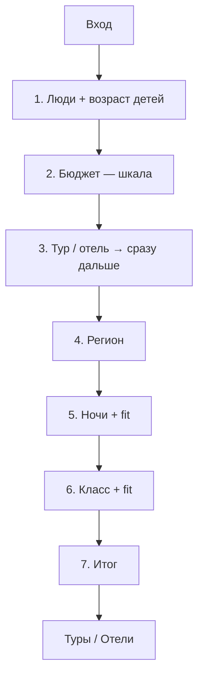

# Лендинг-визард подбора туров/отелей

Человек отвечает на вопросы → кнопка открывает готовую подборку на `online.mosgortur.ru`. Цель бизнеса: выше средний чек (больше ночей / выше класс), не «уложиться в сертификат».

**Статус:** логика согласована. Прод: [`public/podbor.html`](../public/podbor.html) → `https://motrip.ru/podbor`.  
**Прототип:** [`public/podbor-prototype.html`](../public/podbor-prototype.html).

---

## 1. Цель

| Делаем | Не делаем |
|--------|-----------|
| Помочь выбрать: кто едет, бюджет, тур/отель, регион, ночи, класс | Резать выдачу «только до 40 000 ₽» |
| Перейти сразу в нужную подборку | Свой каталог вместо Туры/Отели |
| Сертификат — коротко в футере | Писать про сертификат на шаге бюджета |

---

## 2. Размещение

| Элемент | Решение |
|---------|---------|
| Код | **motrip.ru** — `public/podbor.html` |
| URL | `https://motrip.ru/podbor` |
| МОСГОРТУР | iframe-обёртка + вход с главной |
| Навбар | Не ломаем |

---

## 3. Структура визарда

### Шаг 1 — Кто едет

Как на russia.mosgortur (Level.Travel): взрослые 1–6, дети 0–4, возраст каждого ребёнка (до 1 года … 17 лет).

### Шаг 2 — Бюджет

Шкала 40–360 тыс. шагом 40 тыс., точки-снапы, поле «Своя сумма». Подпись: только «Примерно X ₽ на человека». Без сертификата. Дефолт 80 000 ₽.

### Шаг 3 — Формат

Тур / отель. **Клик сразу открывает шаг 4.**

### Шаг 4 — Регион

Подмосковье / у моря / другой / пока не знаю.

### Шаг 5–6 — Ночи и класс

Все варианты видны. Пометки: обычно в бюджете / может понадобиться доплата / скорее выше бюджета. Дефолт — самый сильный, ещё в бюджете.

Fit v1: клиентская формула-ориентир. Позже — коридоры из поиска.

### Шаг 7 — Итог → handoff

CTA «Показать туры» / «Показать отели». Из iframe — переход в `window.top`.

---

## 4. Handoff

После итога — **сразу выдача**, не пустая форма поиска.

### Матрица

| Формат | Регион | Куда | Выдача |
|--------|--------|------|--------|
| Тур | любой | `online.mosgortur.ru/tours/#module6?action=search&moduleId=68ea30c6-…` | Модуль поиска туров с параметрами |
| Тур | у моря | тот же hash + `beachLines=1,2,3&ticketsIncluded=true` | Туры у моря |
| Отель | любой | `russia.mosgortur.ru/search/Any-RU-to-{City}-RU-…` | Список отелей Level.Travel |
| Тур | Подмосковье | `russia.mosgortur.ru/search/…` (city=Moscow) | Отели Подмосковья — hash `/hotels` теряется при meta-refresh |

**Не используем:** голый `/tours`, `/new/russia-hotels`, `/hotels#module6` (hash съедается redirect).

### Параметры

**Туры** (`buildTourSearchUrl`):

- `adults`, `minNights` / `maxNights`, `dateFrom` / `dateTo` (+14 дней от сегодня)
- `minHotelRating`: 0 / 3 / 4 из класса (simple / usual / higher)
- `maxPrice` не передаём — бюджет только в UTM
- UTM: `utm_source=podbor_wizard&utm_campaign={format}_{region}_{nights}_{level}`

**Отели** (`buildHotelSearchUrl`):

- Path: `Any-RU-to-{City}-RU-departure-{dd.mm.yyyy}-for-{n}-nights-{adults}-adults-0-kids-{stars}-stars-hotel-type`
- City: Sochi (море / другой / не знаю), Moscow (Подмосковье)
- Stars: simple `1..3`, usual `3..4`, higher `4..5`
- Дети: в path всегда `0-kids` (иначе Level.Travel отдаёт 302); `kids` и `kids_ages` — в query UTM для аналитики

### Проверено (curl 200)

1. Тур + море → `/tours/#module6?action=search&…&beachLines=1,2,3`
2. Тур + другой → `/tours/#module6?action=search&…` (не лендинг)
3. Отель + море → `russia.mosgortur.ru/search/…Sochi…`
4. Отель + Подмосковье → `russia.mosgortur.ru/search/…Moscow…`

---

## 5. Сертификат

Номинал 40 000 ₽/человек. Навигатор: https://online.mosgortur.ru/for-tourists/how-get-certificate/  
На шаге бюджета не упоминаем. В футере входа/итога — коротко.

---

## 6. Метрики

Goals: `podbor_start`, `podbor_step_*`, `podbor_handoff` + средний чек / апгрейд.
