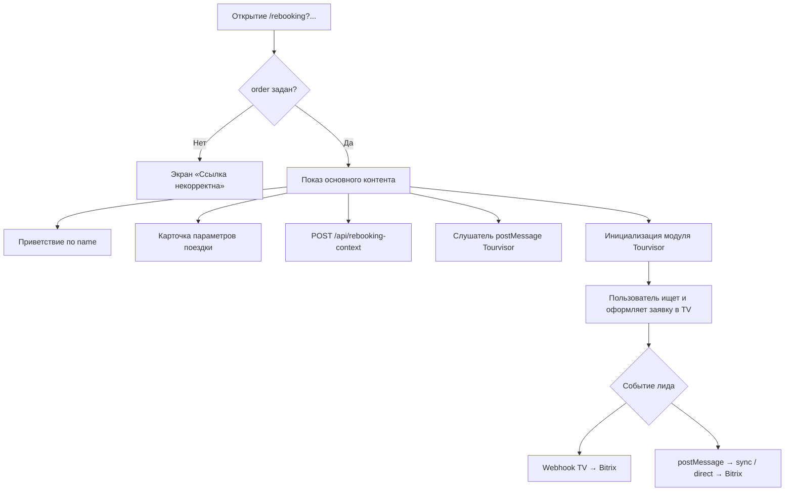

# Лендинг перебронирования `/rebooking`

Техническое описание лендинга для клиентов с отменённой поездкой: входящие параметры, UX-поток, интеграция с Tourvisor и создание лидов в Bitrix24.

---

## Назначение и URL

| Параметр | Значение |
|----------|----------|
| **Production URL** | `https://online.mosgortur.ru/new/rebooking` |
| **Статический файл** | [`public/rebooking.html`](../public/rebooking.html) |
| **Rewrite** | В [`next.config.ts`](../next.config.ts): `/rebooking` → `/rebooking.html` |
| **Индексация** | `noindex,nofollow` |
| **Цель** | Показать параметры отменённого бронирования, предзаполнить поиск Tourvisor и передать заявку на новый тур в Bitrix24 с привязкой к исходной заявке (`order`) и сертификату (`cert`) |

Лендинг предназначен для рассылки персонализированных ссылок (email/SMS). Единственный **обязательный** query-параметр — `order`. Без него страница показывает ошибку «Ссылка некорректна».

---

## Входящие параметры URL

Парсинг выполняется на клиенте (`parseRebookingParams` в `rebooking.html`) и дублируется на сервере (`parseRebookingParamsFromUrl`, `parseRebookingContextFromBody` в [`src/lib/rebooking-context.ts`](../src/lib/rebooking-context.ts)).

| Параметр | Обязательный | Формат | Пример | Влияние |
|----------|:------------:|--------|--------|---------|
| `order` | **Да** | строка, trim | `МГТ-2025-04821` | Валидация страницы; карточка «Заявка № …»; контекст перебронирования; поле `TITLE` и `COMMENTS` лида в Bitrix |
| `cert` | Нет | строка, trim | `СЕРТ-77412` | Карточка «Сертификат № …»; контекст; комментарий лида |
| `name` | Нет | ФИО, URL-encoded | `Иванов%20Иван%20Иванович` | Приветствие «Здравствуйте, {имя}!» (берётся **второе** слово при ≥2 словах, иначе первое); fallback имени клиента в лиде |
| `phone` | Нет, но желательно | `+79001234567` или `89001234567` | **Не показывается** на странице. Сохраняется в контексте и при аннуляции / перебронировании уходит в Bitrix как **оригинальный телефон из рассылки** (`Телефон (из письма)`). Контакт в CRM привязывается по этому номеру, даже если клиент в Tourvisor укажет другой. |
| `dealId` | Нет, но желательно | целое (ID сделки B2C), напр. `108076` | **Не показывается** на странице. Сохраняется в контексте и при аннуляции / перебронировании выводится в комментарий Bitrix: «Сделка B2C (из рассылки): {id}» + ссылка на карточку сделки. Синонимы в URL: `deal_id`, `deal`. |
| `people` | Нет | целое ≥ 0 | `3` | Карточка «N туристов»; расчёт `adults = people - kids`; атрибут `tv-adults` (если 1–4) |
| `kids` | Нет | целое ≥ 0, default `0` | `1` | Подпись состава (взрослые + дети); `tv-kids` (если 1–3). Если `kids > people` — сбрасывается в `0`, возрасты детей очищаются |
| `kid1` | Нет* | целое 0–15 | `7` | Возраст 1-го ребёнка → `tv-kid1`; подпись в карточке |
| `kid2` | Нет* | целое 0–15 | `5` | Возраст 2-го ребёнка → `tv-kid2` |
| `kid3` | Нет* | целое 0–15 | `3` | Возраст 3-го ребёнка → `tv-kid3` |
| `price` | Нет | целое ≥ 0 (руб.) | `185000` | Карточка «бюджет поездки»; `tv-pricefrom=0`, `tv-priceto={price}` |
| `nights` | Нет | целое > 0 | `10` | Карточка «N ночей»; `tv-nights={n},{n}` |
| `date` | Нет | `YYYY-MM-DD` или `DD.MM.YYYY` | `2026-07-14` | Карточка даты; `tv-flydates={dd.mm.yyyy},{dd.mm.yyyy}` |
| `utm_source` | Нет | строка | `email` | Передаётся в лид при прямой отправке (`POST /api/rebooking-lead`) |
| `utm_medium` | Нет | строка | `newsletter` | ↑ |
| `utm_campaign` | Нет | строка | `rebooking_q2` | ↑ |
| `utm_content` | Нет | строка | `banner_a` | ↑ |
| `utm_term` | Нет | строка | — | ↑ |

\* `kid1`…`kid3` учитываются только для первых `kids` детей. При `kids > 0` и отсутствии валидного возраста в консоль пишется `rebooking: missing or invalid kidN`, но страница **не** блокируется.

### Формат даты

Поддерживаются два формата:

- ISO: `2026-07-14` → отображение «14 июля 2026», Tourvisor: `14.07.2026`
- Русский: `14.07.2026` → нормализация в ISO и тот же TV-формат

Любой другой формат передаётся «как есть» без гарантий корректного отображения и работы Tourvisor.

### Генератор ссылок

```bash
node scripts/generate-rebooking-links.js [input.csv] [output.csv]
```

CSV-колонки: `order,cert,name,phone,people,kids,kid1,kid2,kid3,nights,date`.  
Переменная `REBOOKING_BASE_URL` (default: `https://online.mosgortur.ru/new/rebooking`).

Телефон в ссылке нормализуется в формат `+7XXXXXXXXXX` (как в скрипте Excel-рассылки).

---

## UX-поток (пошагово)



1. **Загрузка страницы** — парсинг `window.location.search`.
2. **Валидация** — если `order` пустой, показывается `#invalid-link` («Ссылка некорректна» / «Откройте страницу из письма…»), основной контент скрыт.
3. **Приветствие** — если передан `name`, выводится «Здравствуйте, {имя}!». Логика имени: при формате «Фамилия Имя Отчество» берётся **имя** (2-е слово).
4. **Карточка «Параметры вашей поездки»** — блоки отображаются только при наличии данных:
   - дата начала отдыха;
   - количество ночей;
   - число туристов + расшифровка (взрослые / дети с возрастами);
   - бюджет в ₽.
   - Внизу мелким текстом: «Заявка № {order} · Сертификат № {cert}» (если заданы).
5. **Регистрация контекста** — fire-and-forget `POST /api/rebooking-context` с параметрами бронирования (см. ниже).
6. **Мост Tourvisor** — подписка на `window.message` от `*.tourvisor.ru`.
7. **Модуль Tourvisor** — создаётся `div` с атрибутами поиска, подключается `//tourvisor.ru/module/init.js`. Пользователь **сам** нажимает «Найти» (`tv-runsearch` не выставляется).
8. **После заявки в Tourvisor** — один из путей создания лида в Bitrix (см. раздел «Мосты в Bitrix»). Повторная отправка на клиенте блокируется флагом `leadSubmitted`.

---

## Интеграция с модулем Tourvisor

| Параметр | Атрибут DOM | Условие | Формат значения |
|----------|-------------|---------|-----------------|
| — | `class` | всегда | `tv-search-form tv-moduleid-9978253` |
| — | `id` | всегда | `tourvisor-search` |
| — | `tv-formmode` | всегда | `1` (только отели, без перелёта) |
| — | `tv-formmodes` | всегда | `1` (в UI доступен только режим отелей) |
| `date` | `tv-flydates` + `s_j_date_from` / `s_j_date_to` | если дата распознана | `{dd.mm.yyyy}` |
| `nights` | `tv-nights` + `s_nights_from` / `s_nights_to` | `nights > 0` | `{n},{n}` |
| adults | `s_adults` | `adults` от 1 до 6 | число в query URL |
| `kids` + `kid1`…`kid3` | `child_age_1`…`child_age_3` | при наличии валидных возрастов | число в query URL |
| `price` | `s_price_from` / `s_price_to` | `price > 0` | `0` / `{price}` |

**Module ID:** `9978253`  
**Скрипт инициализации:** `https://tourvisor.ru/module/init.js?{timestamp}` (cache-bust через `Date.now()`).

> **Примечание:** файл [`public/rebooking-destinations.json`](../public/rebooking-destinations.json) с кодами `tv-country` существует в репозитории, но **текущая версия** `rebooking.html` **не** использует селектор направлений и **не** выставляет `tv-country`. Направление пользователь выбирает внутри виджета Tourvisor.

---

## Регистрация контекста

### `POST /api/rebooking-context`

Реализация: [`src/app/api/rebooking-context/route.ts`](../src/app/api/rebooking-context/route.ts), хранилище: [`src/lib/rebooking-context.ts`](../src/lib/rebooking-context.ts).

**Когда вызывается:** сразу после успешной валидации параметров на клиенте.

**Тело запроса (JSON):**

```json
{
  "order": "МГТ-2025-04821",
  "cert": "СЕРТ-77412",
  "name": "Иванов Иван Иванович",
  "phone": "+79001234567",
  "people": 3,
  "kids": 1,
  "kid1": 7,
  "kid2": null,
  "kid3": null,
  "price": 185000,
  "nights": 10,
  "date": "2026-07-14"
}
```

**Ответы:**

| HTTP | Тело | Значение |
|------|------|----------|
| 200 | `{ "ok": true, "visitId": "rb-…" }` | контекст сохранён, визит залогирован |
| 400 | `{ "ok": false, "error": "missing_order" }` | нет `order` |
| 400 | `{ "ok": false, "error": "bad_json" }` | некорректный JSON |

**Хранение:** in-memory `Map`, ключ — `order`, **TTL 30 минут**. При каждом обращении выполняется очистка просроченных записей.

**Зачем нужен:** при webhook от Tourvisor сервер сопоставляет заявку TV с исходным перебронированием:

1. По полю `referer` / `referrer` / `page` / `sourceurl` / `url` в заказе TV — парсинг query-параметров `/rebooking`.
2. Fallback: если `domain` заказа — `motrip.ru`, берётся **самый свежий** контекст за последние **15 минут** (`findRecentRebookingContext`).

---

## Мосты в Bitrix24

Все заявки создаются в смарт-процессе «Перебронирование Крым» ([`src/lib/bitrix-rebooking-lead.ts`](../src/lib/bitrix-rebooking-lead.ts)):

- API: `crm.item.add` (`entityTypeId=1302`, стадия **Перебронь** `DT1302_61:NEW`)
- Аннуляция с лендинга: `POST /api/rebooking-annul` → стадия **Аннуляция** `DT1302_61:UC_QEP35A`
- Контакт: поиск/создание по телефону
- В ленту элемента — полный комментарий (`crm.timeline.comment.add`)
- Поле «Дополнительно об источнике» — тот же текст
- `SOURCE_ID: WEB`
- `TITLE`: `Перебронирование {order} — {отель/страна} — {ФИО}`
- `COMMENTS`: исходная поездка + выбранный тур + UTM + «Источник: /rebooking»

**Переменные окружения:**

| Переменная | Назначение |
|------------|------------|
| `REBOOKING_BITRIX_DOMAIN` | домен Bitrix24 (fallback: `BITRIX_DOMAIN`) |
| `REBOOKING_WEBHOOK_TOKEN` | токен REST webhook |
| `TOURVISOR_AUTHKEY` | ключ Export API Tourvisor |

### Путь 1 (основной): webhook Tourvisor

```
Tourvisor → GET /api/tourvisor-order-webhook?id={tvOrderId}&type={0|1}
         → fetch orders.php / ordersonline.php
         → submitTourvisorOrderToBitrix()
         → crm.lead.add
```

- `type=0` (default) → `orders.php`, `type=1` → `ordersonline.php`
- Регистрация webhook: `node scripts/register-tourvisor-webhook.js` (URL: `https://motrip.ru/api/tourvisor-order-webhook`)
- Без привязки к контексту перебронирования лид **не создаётся** (`skipped: true, reason: "not_rebooking"`)

### Путь 2 (fallback): postMessage + sync

Tourvisor отправляет `postMessage` в родительское окно. Страница слушает события:

**Типы событий-лидов:** `ORDERTOUR`, `HELPTOUR`, `NOTOUR`, `HELPCART`, `TOURSELECTION`, `BOOKTOUR`

Дополнительно событие считается лидом, если:
- `category === 'tourvisor'` и action содержит `ORDERTOUR|HELPTOUR|NOTOUR`, или
- в payload есть `phone`, `hotel` или `hotelname`.

**Алгоритм обработки postMessage:**

1. Проверка origin: только `*.tourvisor.ru`.
2. Если в сообщении есть **телефон** → попытка **прямой** отправки `POST /api/rebooking-lead` с данными тура из postMessage.
3. При ошибке прямой отправки → fallback `POST /api/rebooking-lead/sync`.
4. Если телефона нет → сразу `POST /api/rebooking-lead/sync`.

**`POST /api/rebooking-lead/sync`:**

- Повторно регистрирует контекст.
- Ищет свежие заявки Tourvisor (`fetchRecentTourvisorOrders`, limit 8) за последние **180 сек** (настраивается `maxAgeSeconds`).
- Фильтр: domain = `motrip.ru`, есть телефон, order ID ещё не обработан.
- Клиент делает **3 попытки** с задержками **1.5 с, 3 с, 5 с** (ожидание появления заявки в API TV).
- HTTP **202** + `{ "error": "order_not_ready" }` → клиент повторяет.

### Путь 3: прямая отправка с postMessage

`POST /api/rebooking-lead` — когда в postMessage уже есть телефон и данные тура.

- Honeypot: если `website` непустой → `{ "ok": true }` без создания лида.
- Обязательные поля: `order`, `phone`, данные тура (`tour` или `destination`).
- UTM из query страницы прикладываются к лиду.

---

## Дедупликация

| Уровень | Механизм | TTL / условие |
|---------|----------|---------------|
| Клиент | флаг `leadSubmitted` | до перезагрузки страницы |
| Сервер (TV order ID) | `wasTourvisorOrderProcessed` / `markTourvisorOrderProcessed` | 24 часа |
| Webhook / sync | `skipped: true, reason: "duplicate"` | повтор того же `tourvisorOrderId` |
| Не перебронирование | `skipped: true, reason: "not_rebooking"` | нет контекста и referer не `/rebooking` |

Один клиентский сеанс → максимум один лид в Bitrix (при успешном срабатывании любого из путей).

---

## Встраивание в iframe (online.mosgortur.ru)

Страница читает параметры **только** из `window.location.search` своего документа (iframe), а не из родительского окна.

**Требование:** query-параметры перебронирования должны быть в **`src` iframe**, например:

```html
<iframe
  src="https://online.mosgortur.ru/new/rebooking?order=МГТ-2025-04821&cert=СЕРТ-77412&name=Иванов%20Иван%20Иванович&people=3&kids=1&kid1=7&price=185000&nights=10&date=2026-07-14"
  title="Перебронирование"
></iframe>
```

**Неправильно** — iframe без query (как у `/raduga` до bridge-скрипта):

```html
<!-- ❌ Покажет «Ссылка некорректна» — order не передан -->
<iframe src="https://online.mosgortur.ru/new/rebooking"></iframe>
```

**Рекомендация для SPA mosgortur** (аналог [`public/raduga-parent-bridge.js`](../public/raduga-parent-bridge.js)):

```javascript
var url = new URL('https://online.mosgortur.ru/new/rebooking');
['order', 'cert', 'name', 'people', 'kids', 'kid1', 'kid2', 'kid3', 'price', 'nights', 'date',
 'utm_source', 'utm_medium', 'utm_campaign', 'utm_content', 'utm_term'].forEach(function (key) {
  var value = new URLSearchParams(window.location.search).get(key);
  if (value) url.searchParams.set(key, value);
});
iframe.src = url.toString();
```

Или в Vue/React: `` `:src="'https://online.mosgortur.ru/new/rebooking' + location.search"` `` — если родительская страница уже содержит все нужные параметры.

**Referrer и webhook:** Tourvisor сохраняет URL страницы в поле referer заказа. При корректном iframe `src` с query webhook сможет восстановить `order`/`cert` даже без in-memory контекста (если контекст уже истёк). Fallback `findRecentRebookingContext` работает только для заказов с `domain=motrip.ru`.

**CORS / postMessage:** модуль Tourvisor загружается внутри iframe motrip.ru; postMessage от `tourvisor.ru` приходит в окно лендинга — дополнительная настройка родителя mosgortur не требуется.

---

## Состояния ошибок

### Клиент

| Условие | UI |
|---------|-----|
| Нет `order` | Заголовок «Ссылка некорректна», текст «Откройте страницу из письма, которое мы отправили вам на электронную почту.» |
| `kids > people` | Страница открывается; дети сбрасываются в 0 (без ошибки) |
| Ошибка регистрации контекста | Только `console.warn`, UX не блокируется |
| Ошибка отправки лида | `console.error`, пользователю toast не показывается |

### API

| Endpoint | error | HTTP | Смысл |
|----------|-------|------|-------|
| `/api/rebooking-context` | `missing_order` | 400 | нет order в теле |
| `/api/rebooking-lead/sync` | `order_not_ready` | 202 | заявка TV ещё не появилась в API |
| `/api/rebooking-lead/sync` | `invalid_phone` | 422 | телефон не нормализовался |
| `/api/rebooking-lead` | `missing_fields` | 400 | нет order или phone |
| `/api/rebooking-lead` | `missing_tour` | 400 | нет данных тура |
| `/api/tourvisor-order-webhook` | `missing_id` | 400 | нет query `id` |
| * | `misconfigured` | 500 | нет env Bitrix / Tourvisor |
| * | `bitrix_error` | 502 | ошибка REST Bitrix |

---

## Тестовые URL

### Полный набор параметров

```
https://online.mosgortur.ru/new/rebooking?order=МГТ-2025-04821&cert=СЕРТ-77412&name=Иванов%20Иван%20Иванович&people=3&kids=1&kid1=7&price=185000&nights=10&date=2026-07-14
```

### Минимальный (только order)

```
https://online.mosgortur.ru/new/rebooking?order=TEST-001
```

### Негативный (ошибка)

```
https://online.mosgortur.ru/new/rebooking
https://online.mosgortur.ru/new/rebooking?cert=СЕРТ-77412
```

### С UTM

```
https://online.mosgortur.ru/new/rebooking?order=МГТ-2025-04821&cert=СЕРТ-77412&name=Иванов%20Иван%20Иванович&people=2&price=150000&nights=7&date=2026-08-01&utm_source=email&utm_campaign=rebooking_test
```

---

## Чеклист приёмки

### Визуал и UX (375px и desktop)

- [ ] При валидном `order` — карточка параметров, модуль Tourvisor, **нет** экрана «Ссылка некорректна»
- [ ] При отсутствии `order` — только экран «Ссылка некорректна»
- [ ] Тестовая ссылка: **14 июля 2026**, **10 ночей**, **3 туриста** (2 взрослых + 1 ребёнок 7 лет), **185 000 ₽**
- [ ] Внизу карточки: «Заявка № МГТ-2025-04821 · Сертификат № СЕРТ-77412»
- [ ] Приветствие: «Здравствуйте, Иван!»
- [ ] Те же значения предзаполнены в форме Tourvisor (дата, ночи, взрослые, ребёнок, цена до)
- [ ] Поиск **не** запускается автоматически — пользователь нажимает «Найти»
- [ ] Нет отдельной нижней формы заявки на странице

### API и интеграции

- [ ] `POST /api/rebooking-context` → `{ "ok": true }` при загрузке страницы
- [ ] После заявки в Tourvisor — лид в Bitrix с `UF_CRM_LEAD_TYPE=rebooking` (или без него при fallback)
- [ ] В комментарии лида: исходная заявка, сертификат, состав, бюджет, данные выбранного тура
- [ ] Повторная заявка с тем же TV order ID не создаёт дубликат (24 ч)
- [ ] Webhook `GET /api/tourvisor-order-webhook?id=...` отрабатывает при настроенном `TOURVISOR_AUTHKEY`

### iframe (если используется на mosgortur)

- [ ] `iframe.src` содержит полный query (`order` минимум)
- [ ] Без query в src — «Ссылка некорректна»
- [ ] UTM на родителе прокидываются в src iframe

---

## Связанные файлы

| Файл | Роль |
|------|------|
| [`public/rebooking.html`](../public/rebooking.html) | UI, парсинг URL, Tourvisor, postMessage-мост |
| [`src/lib/rebooking-context.ts`](../src/lib/rebooking-context.ts) | In-memory контекст, TTL, парсинг URL/body |
| [`src/lib/rebooking-visit-store.ts`](../src/lib/rebooking-visit-store.ts) | Персистентный журнал визитов (`storage/rebooking-visits.json`) |
| [`src/lib/tourvisor-rebooking.ts`](../src/lib/tourvisor-rebooking.ts) | Fetch заказов TV, маппинг в лид, dedup, sync |
| [`src/lib/bitrix-rebooking-lead.ts`](../src/lib/bitrix-rebooking-lead.ts) | Формирование и отправка лида в Bitrix |
| [`src/app/rebooking-admin/`](../src/app/rebooking-admin/) | Админка визитов `/rebooking-admin` |
| [`src/app/api/rebooking-visits/route.ts`](../src/app/api/rebooking-visits/route.ts) | GET список визитов (пароль) |
| [`src/app/api/rebooking-track/route.ts`](../src/app/api/rebooking-track/route.ts) | POST события Tourvisor с клиента |
| [`src/app/api/rebooking-context/route.ts`](../src/app/api/rebooking-context/route.ts) | POST регистрация контекста + визита |
| [`src/app/api/rebooking-lead/route.ts`](../src/app/api/rebooking-lead/route.ts) | POST прямая отправка лида |
| [`src/app/api/rebooking-lead/sync/route.ts`](../src/app/api/rebooking-lead/sync/route.ts) | POST sync после postMessage |
| [`src/app/api/tourvisor-order-webhook/route.ts`](../src/app/api/tourvisor-order-webhook/route.ts) | GET webhook Tourvisor |
| [`next.config.ts`](../next.config.ts) | Rewrite `/rebooking` |
| [`scripts/generate-rebooking-links.js`](../scripts/generate-rebooking-links.js) | Массовая генерация ссылок |
| [`scripts/register-tourvisor-webhook.js`](../scripts/register-tourvisor-webhook.js) | Регистрация TV webhook |
| [`docs/infrastructure.md`](infrastructure.md) | Env-переменные и краткий обзор |

---

## Админка визитов `/rebooking-admin`

Password-protected панель для просмотра активности на лендинге перебронирования.

| Параметр | Значение |
|----------|----------|
| **URL** | `https://online.mosgortur.ru/new/rebooking-admin` |
| **Пароль** | env `REBOOKING_ADMIN_PASSWORD` (default в `.env.example`: `rebooking2026`) |
| **Хранилище** | `storage/rebooking-visits.json` (переживает рестарт; до 5000 записей) |

### Что логируется

| Событие | Источник | Статус |
|---------|----------|--------|
| Заход на страницу | `POST /api/rebooking-context` | `visited` |
| Событие Tourvisor (postMessage) | `POST /api/rebooking-track` | `searched` (если есть тур/отель или тип ORDERTOUR и т.п.) |
| Заявка в Bitrix | `/api/rebooking-lead`, sync, webhook | `submitted` |

### Колонки в таблице

Заявка (`order`), сертификат, имя клиента, время захода, последнее событие Tourvisor, выбранный отель/страна, телефон и email из формы, статус воронки.

Фильтр по номеру заявки, сортировка — новые сверху.
